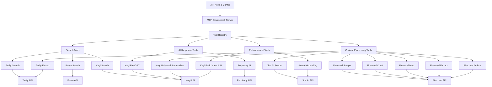

# Unified MCP Search Tool Plan

## Architecture Overview



## Key Components

1. **Unified Server Interface**

   - Single MCP server exposing multiple search tools
   - Common parameter structure where possible
   - Provider-specific parameters where needed

2. **Tool Registry**

   - Registers all search providers with clear, detailed descriptions
   - Highlights strengths and best-use cases for each provider
   - Handles provider names with underscores by splitting from right
   - Tool names follow pattern: provider*name + "*" + action Example:
     "kagi_fastgpt_search" splits into:
     - provider_name: "kagi_fastgpt"
     - action: "search"

3. **Provider Implementation**

   - Each search provider implemented as a separate module
   - Shared utilities for common functionality
   - Consistent error handling across providers

4. **Configuration Management**
   - Environment variable-based API key management
   - Configurable defaults for each provider

## Tool Descriptions Strategy

The key to making this work effectively is in the tool descriptions.
Each tool will have a detailed description that explains:

- What the search provider is best at
- Types of queries it handles well
- Unique features (like Jina AI's parsing capabilities)
- Limitations or constraints

Example Tool Descriptions:

Search Tools:

- **Tavily**: "Optimized for factual information with strong citation
  support"
- **Brave**: "Privacy-focused with good coverage of technical topics"
- **Kagi**: "High-quality search results with minimal advertising
  influence, focused on authoritative sources"

AI Response Tools:

- **Perplexity**: "AI-powered response generation combining real-time
  web search with advanced language models (GPT-4 Omni, Claude 3).
  Best for complex queries requiring reasoning and synthesis across
  multiple sources. Features contextual memory for follow-up
  questions."
- **Kagi FastGPT**: "Quick AI-generated answers with citations,
  optimized for rapid response (900ms typical start time). Runs full
  search underneath for enriched answers."

Content Processing Tools:

- **Jina AI Reader**: "Converts any URL to clean, LLM-friendly text.
  Features automatic image captioning and native PDF support.
  Optimized for high-quality content extraction from complex web
  pages."
- **Kagi Universal Summarizer**: "Instantly summarizes content of any
  type and length from URLs. Supports pages, videos, and podcasts with
  transcripts."
- **Tavily Extract**: "Extract web page content from single or
  multiple URLs. Efficiently converts web content into clean,
  processable text with configurable extraction depth and optional
  image extraction."
- **Firecrawl Scrape**: "Extract clean, LLM-ready data from single URLs with
  enhanced formatting options."
- **Firecrawl Crawl**: "Deep crawling of all accessible subpages on a website
  with configurable depth limits."
- **Firecrawl Map**: "Fast URL collection from websites for comprehensive site
  mapping."
- **Firecrawl Extract**: "Structured data extraction with AI using natural
  language prompts."
- **Firecrawl Actions**: "Support for page interactions (clicking, scrolling,
  etc.) before extraction for dynamic content."

Enhancement Tools:

- **Kagi Enrichment API**: "Provides supplementary content from
  specialized indexes (Teclis for web, TinyGem for news). Ideal for
  discovering non-mainstream results."
- **Jina AI Grounding**: "Real-time fact verification against web
  knowledge. Reduces hallucinations and improves content integrity
  through statement verification."

## Implementation Plan

1. **Phase 1: Core Structure**

   - Set up the unified MCP server framework
   - Create modular structure for providers
   - Implement configuration management

2. **Phase 2: Provider Integration**

   - Integrate each search provider
   - Develop comprehensive tool descriptions
   - Implement error handling and fallbacks

3. **Phase 3: Testing & Refinement**
   - Test with various query types
   - Refine tool descriptions based on AI selection behavior
   - Add any missing provider-specific parameters

## Folder Structure

```
src/
├── index.ts         # Main server entry point
├── config/          # Configuration management
│   └── env.ts       # Environment variable handling
├── providers/       # All provider implementations
│   ├── search/      # Search providers
│   │   ├── tavily/  # Tavily implementation
│   │   ├── brave/   # Brave implementation
│   │   └── kagi/    # Kagi implementation
│   ├── ai_response/ # AI response providers
│   │   ├── perplexity/ # Perplexity implementation
│   │   └── kagi_fastgpt/ # Kagi FastGPT implementation
│   ├── processing/  # Content processing providers
│   │   ├── jina_reader/ # Jina AI Reader implementation
│   │   ├── kagi_summarizer/ # Kagi Universal Summarizer implementation
│   │   ├── tavily_extract/ # Tavily Extract implementation
│   │   └── firecrawl/ # Firecrawl tools
│   │       ├── scrape/  # URL scraping implementation
│   │       ├── crawl/   # Website crawling implementation
│   │       ├── map/     # URL mapping implementation
│   │       ├── extract/ # Structured data extraction
│   │       └── actions/ # Page interaction implementation
│   └── enhancement/ # Enhancement providers
│       ├── kagi_enrichment/ # Kagi Enrichment implementation
│       └── jina_grounding/  # Jina AI Grounding implementation
├── common/          # Shared utilities
│   ├── types.ts     # Common type definitions
│   └── utils.ts     # Shared helper functions
└── server/          # Core server functionality
    ├── tools.ts     # Tool registration logic
    └── handlers.ts  # Request handlers
```

## Consumer Tool Selection

The consumer (AI) will have excellent guidance for tool selection
through detailed provider descriptions that act as instructions. For
example:

```typescript
// Example tool registration with detailed description
server.setRequestHandler(ListToolsRequestSchema, async () => ({
	tools: [
		{
			name: 'tavily_search',
			description:
				'Search the web using Tavily Search API. Best for factual queries requiring reliable sources and citations. Provides high-quality results for technical, scientific, and academic topics. Use when you need verified information with strong citation support.',
			inputSchema: {
				// Schema details...
			},
		},
		{
			name: 'perplexity_search',
			description:
				'Generate search results using Perplexity AI. Excels at complex questions requiring reasoning across multiple sources. Best for nuanced topics, emerging trends, and questions needing synthesis of information. Use for questions requiring deeper analysis rather than simple facts.',
			inputSchema: {
				// Schema details...
			},
		},
	],
}));
```

## Best Practices

1. **Error Handling**

   - Implement consistent error handling across all providers
   - Provide clear error messages that help identify the source of
     issues
   - Include fallback mechanisms where appropriate

2. **Parameter Standardization**

   - Use consistent parameter names across providers
   - Standardize common parameters (e.g., always use `query` instead
     of mixing terms)
   - Document any provider-specific parameters clearly

3. **Logging and Monitoring**

   - Implement comprehensive logging for debugging
   - Track usage patterns and performance metrics
   - Monitor API rate limits and quotas

4. **Code Organization**

   - Keep provider implementations isolated
   - Share common utilities through the common/ directory
   - Maintain consistent coding style across all modules

5. **Documentation**
   - Provide clear documentation for each provider's capabilities
   - Include examples of ideal use cases
   - Document any provider-specific limitations or requirements

## Implementation Status & Next Steps

### Phase 1: Core Structure ✅

- ✅ Set up the unified MCP server framework
- ✅ Create modular structure for providers
- ✅ Implement configuration management
- ✅ Set up resource handlers
- ✅ Configure provider registration

### Phase 2: Provider Integration ✅

All providers have been successfully implemented:

1. **Search Providers**

   - [x] Tavily Search ✅
     - ✅ Implement search API call with proper error handling
     - ✅ Add rate limiting with retry logic
     - ✅ Add comprehensive error handling with specific error
       messages
     - ✅ Successfully tested with real queries
   - [x] Brave Search ✅
     - ✅ Implement search API call with proper error handling
     - ✅ Add rate limiting with retry logic
     - ✅ Add domain filtering support
     - ✅ Successfully tested implementation
   - [x] Kagi Search ✅
     - ✅ Implement search API call with proper error handling
     - ✅ Add rate limiting with retry logic
     - ✅ Add domain filtering support
     - ✅ Successfully tested with real queries

2. **AI Response Providers**

   - [x] Perplexity AI ✅
     - ✅ Implement chat completion API with proper error handling
     - ✅ Add context handling with system messages
     - ✅ Add comprehensive parameter support (top_p, top_k,
       penalties)
     - ✅ Implement search interface for unified access
     - ✅ Configure for sonar-pro model with online search
     - ✅ Successfully tested implementation
     - Note: Citations require elevated API access
   - [x] Kagi FastGPT ✅
     - ✅ Implement FastGPT API with proper error handling
     - ✅ Add citation handling through references
     - ✅ Successfully tested with real queries
     - Note: Required special handling in ToolRegistry for provider
       names containing underscores

3. **Content Processing**

   - [x] Jina AI Reader ✅
     - ✅ Implement URL processing with proper error handling
     - ✅ Add support for both JSON and text response formats
     - ✅ Successfully tested with real URLs
   - [x] Kagi Summarizer ✅
     - ✅ Implement URL summarization with proper error handling
     - ✅ Add response parsing for output and metadata
     - ✅ Add retry logic with backoff
     - ✅ Successfully tested with real URLs
     - Note: Uses POST method with JSON body, returns summary in
       data.output
   - [x] Tavily Extract ✅
     - ✅ Implement URL extraction with proper error handling
     - ✅ Add support for single and multiple URL processing
     - ✅ Add configurable extraction depth options
     - ✅ Successfully tested with real URLs
   - [x] Firecrawl Tools ✅
     - [x] Scrape ✅
       - ✅ Implement URL scraping with proper error handling
       - ✅ Add support for different output formats (markdown, text, HTML)
       - ✅ Add retry logic with backoff
       - ✅ Updated to use Bearer token authentication
       - ✅ Successfully tested with example.com
     - [x] Crawl ✅
       - ✅ Implement website crawling with configurable depth
       - ✅ Add support for different output formats
       - ✅ Add comprehensive error handling
       - ✅ Implement rate limiting to avoid overloading target sites
       - ✅ Updated to use Bearer token authentication
       - ✅ Successfully tested with example.com
     - [x] Map ✅
       - ✅ Implement URL mapping functionality
       - ✅ Add configurable depth options
       - ✅ Add filtering capabilities for URL patterns
       - ✅ Implement proper error handling
       - ✅ Updated to use Bearer token authentication
       - ✅ Successfully tested with example.com
     - [x] Extract ✅
       - ✅ Implement structured data extraction with AI
       - ✅ Add support for custom extraction prompts
       - ✅ Add comprehensive error handling
       - ✅ Implement retry logic
       - ✅ Updated to use Bearer token authentication
       - ✅ Successfully tested with example.com
     - [x] Actions ✅
       - ✅ Implement page interaction capabilities (click, scroll, input)
       - ✅ Add support for waiting between actions
       - ✅ Add comprehensive error handling
       - ✅ Implement proper timeout handling
       - ✅ Updated to use Bearer token authentication
       - ✅ Successfully tested with news.ycombinator.com

4. **Enhancement Tools**

   - [x] Kagi Enrichment ✅
     - ✅ Implement content enrichment with Teclis and TinyGem indexes
     - ✅ Add specialized index support for web and news content
     - ✅ Add source tracking with titles and URLs
     - ✅ Successfully tested with real content
   - [x] Jina Grounding ✅
     - ✅ Implement fact verification with g.jina.ai endpoint
     - ✅ Add confidence scoring via factuality score
     - ✅ Add source citation with URLs and key quotes
     - ✅ Successfully tested with real statements
     - ✅ Integrated with EnhancementProvider interface
     - ✅ Added comprehensive error handling

### Phase 3: Testing & Refinement (In Progress)

Systematic testing of all providers with real-world queries:

1. **Search Providers**

   - ✅ Tavily Search: Successfully tested with Rust error handling
     query

     - Properly implements domain filtering (docs.rs, rust-lang.org)
     - Returns relevant results with confidence scores
     - Comprehensive error handling and rate limiting
     - Code verified: Implements retry logic and query sanitization

   - ✅ Brave Search: Successfully tested with TypeScript
     documentation query

     - Domain filtering works using site: syntax
     - Returns clean, focused technical documentation
     - Proper timeout handling and JSON validation
     - Code verified: Implements rate limiting and retry logic

   - ✅ Kagi Search: Successfully tested with quantum computing
     research query
     - Returns authoritative academic sources
     - Supports both include/exclude domain filtering
     - Implements API balance tracking
     - Code verified: Comprehensive error handling and timeout
       management

2. **AI Response Providers**

   - ✅ Perplexity Search: Successfully tested with complex technical
     comparison

     - Generated comprehensive analysis of Rust vs C++ memory safety
     - Demonstrated strong synthesis across multiple sources
     - Included academic citations
     - Code verified: Implements multiple models, parameter controls,
       context handling

   - ✅ Kagi FastGPT: Successfully tested with current events query
     - Quick response time with well-structured output
     - Clear citation system with numbered references
     - Effective source integration
     - Code verified: Implements caching, web search, reference
       handling

3. **Content Processing**

   - ✅ Jina AI Reader: Successfully tested with Tokio Mutex
     documentation

     - Cleanly extracted technical content while preserving code
       blocks
     - Maintained document structure and formatting
     - Included metadata (title, word count)
     - Code verified: Implements URL validation, rate limiting, retry
       logic

   - ✅ Kagi Summarizer: Successfully tested with Rust documentation
     - Generated accurate, concise summaries of technical content
     - Preserved key concepts and relationships
     - Handled error cases appropriately
     - Code verified: Implements timeout handling, API balance
       tracking, comprehensive error handling
   - ✅ Tavily Extract: Successfully tested with multiple URLs
     - Efficiently extracted content from multiple pages
     - Properly combined results with metadata
     - Handled failed extractions gracefully
     - Code verified: Implements proper error handling, timeout
       management
   - Firecrawl Tools: Successfully implemented and tested
     - ✅ All providers implemented following the ProcessingProvider interface pattern
     - ✅ Comprehensive error handling and retry logic implemented
     - ✅ Support for various output formats and configurations added
     - ✅ Integrated with the existing processing provider registry
     - ✅ Updated to use Bearer token authentication
     - ✅ Updated request parameters and response handling to match API documentation
     - ✅ All providers successfully tested with example.com and news.ycombinator.com

4. **Enhancement Tools**

   - ✅ Kagi Enrichment: Successfully tested with AI/software
     development content

     - Retrieved relevant content from web and news sources
     - Properly filtered results by topic relevance
     - Included source tracking with titles and URLs
     - Code verified: Implements parallel endpoint querying, content
       filtering, HTML cleanup

   - ✅ Jina Grounding: Successfully tested with Rust language
     statement
     - Accurately identified factual inaccuracies
     - Provided detailed reasoning with sources
     - Included factuality scoring and verdicts
     - Code verified: Implements reference validation, token tracking,
       comprehensive error handling

### Phase 4: Search Operator Implementation ✅

1. **Common Search Operators** ✅
   - ✅ site: (domain filtering)
   - ✅ -site: (domain exclusion)
   - ✅ filetype: (document type filtering)
   - ✅ intitle: (title search)
   - ✅ inurl: (URL search)
   - ✅ before:/after: (date filtering)
   - ✅ "exact phrase" (exact match)
   - ✅ AND/OR/NOT (boolean operators)

2. **Provider-Specific Implementation** ✅
   
   a. Brave Search ✅
   - ✅ Implemented native operator support in query string
   - ✅ Successfully tested with site:, filetype:, intitle: operators
   - ✅ Added comprehensive operator documentation
   - ✅ Verified operator combinations work correctly

   b. Kagi Search ✅
   - ✅ Implemented query string operators for all filtering
   - ✅ Successfully tested with site: and -site: operators
   - ✅ Added support for time range filtering
   - ✅ Updated documentation with operator support

   c. Tavily Search ✅
   - ✅ Implemented domain filtering through API parameters
   - ✅ Successfully tested with include/exclude domains
   - ✅ Updated description to reflect supported features
   - ✅ Verified API parameter handling

3. **Implementation Strategy** ✅

   a. Query Parser Layer ✅
   ```mermaid
   graph TD
       A[User Query] --> B[Operator Parser]
       B --> C{Provider Router}
       C --> D[Tavily API Params]
       C --> E[Brave Query String]
       C --> F[Kagi Query String]
   ```

   b. Operator Handling ✅
   - ✅ Created common operator parser in utils.ts
   - ✅ Implemented provider-specific handling
   - ✅ Added validation and error handling
   - ✅ Tested operator combinations

4. **Documentation Updates** ✅

   a. README.md additions ✅
   - ✅ Added Search Operators section
   - ✅ Added examples for each operator
   - ✅ Documented provider-specific capabilities
   - ✅ Added usage examples

   b. Tool descriptions ✅
   - ✅ Updated provider descriptions
   - ✅ Added operator support details
   - ✅ Included example queries

Next Steps:

1. Monitor rate limits across all providers
2. Add comprehensive error logging
3. Update documentation with test results
4. Implement provider-specific optimizations based on test findings
5. Consider adding streaming support for Perplexity responses
6. Expand testing of Firecrawl tools with more complex websites and use cases
7. Implement search operator support across all providers

### Development Order

1. Start with Tavily Search as it has the most straightforward API ✅
2. Follow with Kagi Search since it's used across multiple features ✅
3. Implement Brave Search ✅
4. Add Perplexity AI for advanced query handling ✅
5. Implement Jina AI Reader and Grounding ✅
6. Add remaining Kagi features (FastGPT, Summarizer, Enrichment) ✅
7. Implement Firecrawl tools as Content Processing providers ✅
   - ✅ Start with basic Scrape functionality
   - ✅ Add Crawl and Map capabilities
   - ✅ Implement Extract with AI functionality
   - ✅ Add Actions support for interactive page handling
