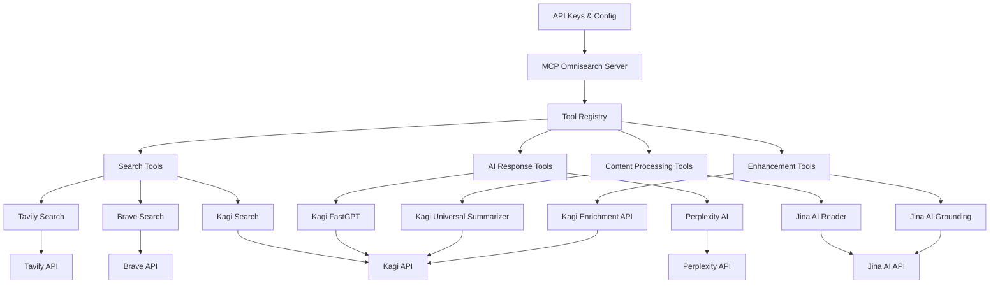

# Unified MCP Search Tool Plan

## Architecture Overview



## Key Components

1. **Unified Server Interface**
   - Single MCP server exposing multiple search tools
   - Common parameter structure where possible
   - Provider-specific parameters where needed

2. **Tool Registry**
   - Registers all search providers with clear, detailed descriptions
   - Highlights strengths and best-use cases for each provider

3. **Provider Implementation**
   - Each search provider implemented as a separate module
   - Shared utilities for common functionality
   - Consistent error handling across providers

4. **Configuration Management**
   - Environment variable-based API key management
   - Configurable defaults for each provider

## Tool Descriptions Strategy

The key to making this work effectively is in the tool descriptions. Each tool will have a detailed description that explains:

- What the search provider is best at
- Types of queries it handles well
- Unique features (like Jina AI's parsing capabilities)
- Limitations or constraints

Example Tool Descriptions:

Search Tools:
- **Tavily**: "Optimized for factual information with strong citation support"
- **Brave**: "Privacy-focused with good coverage of technical topics"
- **Kagi**: "High-quality search results with minimal advertising influence, focused on authoritative sources"

AI Response Tools:
- **Perplexity**: "AI-powered response generation combining real-time web search with advanced language models (GPT-4 Omni, Claude 3). Best for complex queries requiring reasoning and synthesis across multiple sources. Features contextual memory for follow-up questions."
- **Kagi FastGPT**: "Quick AI-generated answers with citations, optimized for rapid response (900ms typical start time). Runs full search underneath for enriched answers."

Content Processing Tools:
- **Jina AI Reader**: "Converts any URL to clean, LLM-friendly text. Features automatic image captioning and native PDF support. Optimized for high-quality content extraction from complex web pages."
- **Kagi Universal Summarizer**: "Instantly summarizes content of any type and length from URLs. Supports pages, videos, and podcasts with transcripts."

Enhancement Tools:
- **Kagi Enrichment API**: "Provides supplementary content from specialized indexes (Teclis for web, TinyGem for news). Ideal for discovering non-mainstream results."
- **Jina AI Grounding**: "Real-time fact verification against web knowledge. Reduces hallucinations and improves content integrity through statement verification."

## Implementation Plan

1. **Phase 1: Core Structure**
   - Set up the unified MCP server framework
   - Create modular structure for providers
   - Implement configuration management

2. **Phase 2: Provider Integration**
   - Integrate each search provider
   - Develop comprehensive tool descriptions
   - Implement error handling and fallbacks

3. **Phase 3: Testing & Refinement**
   - Test with various query types
   - Refine tool descriptions based on AI selection behavior
   - Add any missing provider-specific parameters

## Folder Structure

```
src/
├── index.ts         # Main server entry point
├── config/          # Configuration management
│   └── env.ts       # Environment variable handling
├── providers/       # All provider implementations
│   ├── search/      # Search providers
│   │   ├── tavily/  # Tavily implementation
│   │   ├── brave/   # Brave implementation
│   │   └── kagi/    # Kagi implementation
│   ├── ai_response/ # AI response providers
│   │   ├── perplexity/ # Perplexity implementation
│   │   └── kagi_fastgpt/ # Kagi FastGPT implementation
│   ├── processing/  # Content processing providers
│   │   ├── jina_reader/ # Jina AI Reader implementation
│   │   └── kagi_summarizer/ # Kagi Universal Summarizer implementation
│   └── enhancement/ # Enhancement providers
│       ├── kagi_enrichment/ # Kagi Enrichment implementation
│       └── jina_grounding/  # Jina AI Grounding implementation
├── common/          # Shared utilities
│   ├── types.ts     # Common type definitions
│   └── utils.ts     # Shared helper functions
└── server/          # Core server functionality
    ├── tools.ts     # Tool registration logic
    └── handlers.ts  # Request handlers
```

## Consumer Tool Selection

The consumer (AI) will have excellent guidance for tool selection through detailed provider descriptions that act as instructions. For example:

```typescript
// Example tool registration with detailed description
server.setRequestHandler(ListToolsRequestSchema, async () => ({
  tools: [
    {
      name: 'tavily_search',
      description: 'Search the web using Tavily Search API. Best for factual queries requiring reliable sources and citations. Provides high-quality results for technical, scientific, and academic topics. Use when you need verified information with strong citation support.',
      inputSchema: {
        // Schema details...
      }
    },
    {
      name: 'perplexity_search',
      description: 'Generate search results using Perplexity AI. Excels at complex questions requiring reasoning across multiple sources. Best for nuanced topics, emerging trends, and questions needing synthesis of information. Use for questions requiring deeper analysis rather than simple facts.',
      inputSchema: {
        // Schema details...
      }
    }
  ]
}));
```

## Best Practices

1. **Error Handling**
   - Implement consistent error handling across all providers
   - Provide clear error messages that help identify the source of issues
   - Include fallback mechanisms where appropriate

2. **Parameter Standardization**
   - Use consistent parameter names across providers
   - Standardize common parameters (e.g., always use `query` instead of mixing terms)
   - Document any provider-specific parameters clearly

3. **Logging and Monitoring**
   - Implement comprehensive logging for debugging
   - Track usage patterns and performance metrics
   - Monitor API rate limits and quotas

4. **Code Organization**
   - Keep provider implementations isolated
   - Share common utilities through the common/ directory
   - Maintain consistent coding style across all modules

5. **Documentation**
   - Provide clear documentation for each provider's capabilities
   - Include examples of ideal use cases
   - Document any provider-specific limitations or requirements
